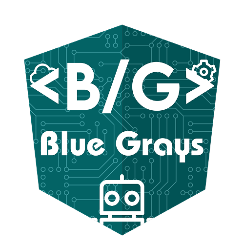

<div align="center">



# Arduino Projeleri · Arduino Projects

**78+ Arduino projesinin kaynak kodu ve devre şemaları — hepsi tek bir yerde.**
**Source code & circuit diagrams for 78+ Arduino projects — all in one place.**

[](https://github.com/yemreeke/Arduino-Projeleri/stargazers)
[](https://github.com/yemreeke/Arduino-Projeleri/network/members)
[](LICENSE.md)
[](https://bluegrays.com)
[](https://www.instagram.com/bluegraysapp/)
[](https://www.tiktok.com/@bluegrays.ino)

[](https://apps.apple.com/tr/app/arduino-projects-bluegrays/id6502332602)
[](https://play.google.com/store/apps/details?id=com.bluegrays.ino)

</div>

---

## 🚀 BlueGrays Uygulaması · The BlueGrays App

> 🇹🇷 **Bu repodaki tüm projeler ve çok daha fazlası, [BlueGrays](https://bluegrays.com) mobil uygulamasında sizi bekliyor.** Devre şemaları, kaynak kodları, adım adım video rehberleri, komponent listeleri ve kişisel atölye yönetimi — hepsi cebinizde.
>
> 🇬🇧 **Every project in this repo — and a whole lot more — lives inside the [BlueGrays](https://bluegrays.com) mobile app.** Circuit diagrams, source code, step-by-step video guides, component lists and a personal workshop manager — all in your pocket.

<div align="center">

### 📱 Hemen İndirin · Download Now

[](https://apps.apple.com/tr/app/arduino-projects-bluegrays/id6502332602)
&nbsp;&nbsp;
[](https://play.google.com/store/apps/details?id=com.bluegrays.ino)

**🌐 [bluegrays.com](https://bluegrays.com)**

</div>

---

## ✨ Uygulama Özellikleri · App Features

| 🇹🇷 Türkçe | 🇬🇧 English |
|---|---|
| 📚 **Zengin Proje Kütüphanesi** — Başlangıçtan ileri seviyeye Arduino projeleri | 📚 **Rich Project Library** — Arduino projects from beginner to advanced |
| 🔌 **150+ Komponent Veritabanı** — Pin şemaları, teknik detaylar, kullanım örnekleri | 🔌 **150+ Component Database** — Pinouts, specs, usage examples |
| 🛠️ **Kişisel Atölye Yönetimi** — Komponentlerinizi ekleyin, stok takibi yapın | 🛠️ **Personal Workshop Manager** — Add components, track inventory |
| 🤖 **Akıllı Proje Önerileri** — Elinizdeki parçalarla yapabileceğiniz projeleri görün | 🤖 **Smart Project Suggestions** — See what you can build with what you have |
| 🏆 **Rozet Sistemi** — Bronz, Gümüş, Altın, Platin, Elmas — 5 seviye | 🏆 **Badge System** — Bronze, Silver, Gold, Platinum, Diamond — 5 tiers |
| 🌍 **6 Dil Desteği** — TR, EN, DE, ES, FR, IT | 🌍 **6 Languages** — TR, EN, DE, ES, FR, IT |
| 🎥 **Video Rehberler** — Her projede adım adım kurulum videosu | 🎥 **Video Tutorials** — Step-by-step build videos for every project |
| 💎 **Ücretsiz Başlangıç** — Ücretsiz indirin, premium ile sınırları kaldırın | 💎 **Free to Start** — Download free, go premium to unlock everything |

---

## 📂 Bu Repo Hakkında · About This Repo

🇹🇷 Instagram sayfamda paylaştığım Arduino projelerinin **kaynak kodlarına**, **devre şemalarına** ve **görsellerine** buradan ulaşabilirsiniz. Her klasör tek bir projeye ait — `.ino` dosyası, devre şeması ve referans görselleri içerir.

🇬🇧 You'll find the **source code**, **circuit diagrams** and **reference images** for every Arduino project I've shared on Instagram. Each folder is a self-contained project with the `.ino` sketch, schematic and reference images.

### 🧰 Proje Kategorileri · Project Categories

| Kategori · Category | Projeler · Projects |
|---|---|
| 💡 **LED & Animasyonlar · LED & Animations** | 001–008, 039–040, 069–076 |
| 🔘 **Butonlar & Girişler · Buttons & Inputs** | 009–010, 059–064 |
| 🔊 **Ses & Müzik · Sound & Music** | 013–015, 026 |
| 📡 **Sensörler · Sensors** (LDR, PIR, IR, Flame, Gas, DHT11, NTC, TCRT5000) | 011–012, 016–018, 024–025, 050–055, 077–078 |
| 📏 **Mesafe & Park · Distance & Parking** | 027–028, 031 |
| 🖥️ **LCD Ekran · LCD Displays** | 029–033, 044, 046, 056, 064 |
| 🔢 **7-Segment Display** | 041–043, 047–049 |
| ⚡ **Yüksek Voltaj · High Voltage (220V)** | 019–021 |
| 🚨 **Güvenlik · Security** (Lazer, RFID, Reed) | 022–023, 037–038, 053–054 |
| 📶 **Kablosuz · Wireless** (Bluetooth, Arduino-to-Arduino) | 034, 057–058 |
| ⚙️ **Motorlar · Motors** (Servo, Step) | 035–036, 060, 067–068 |
| ⏰ **Saat · RTC Clock** | 045–046, 048 |
| ⌨️ **Özel Klavyeler · Custom Keyboards** | 065–066 |

---

## 🛠️ Nasıl Kullanılır · How to Use

```bash
# 1️⃣ Klonlayın · Clone
git clone https://github.com/yemreeke/Arduino-Projeleri.git

# 2️⃣ İlgilendiğiniz projeye gidin · Open the project you want
cd "Arduino-Projeleri/001 - Led Yakma"

# 3️⃣ .ino dosyasını Arduino IDE'de açın · Open the .ino file in Arduino IDE
# 4️⃣ Devre şemasını incelerken kodu yükleyin · Wire it up and upload
```

> 🇹🇷 **İpucu:** Devre kurulumu, gerekli komponent listesi ve video anlatımı [BlueGrays uygulamasında](https://bluegrays.com).
> 🇬🇧 **Tip:** Full wiring guide, component checklist and video walkthrough live inside the [BlueGrays app](https://bluegrays.com).

---

## 🤝 Topluluk · Community

<div align="center">

| Platform | Bağlantı · Link |
|---|---|
| 🌐 Website | **[bluegrays.com](https://bluegrays.com)** |
| 📸 Instagram | [@bluegraysapp](https://www.instagram.com/bluegraysapp/) |
| 🎵 TikTok | [@bluegrays.ino](https://www.tiktok.com/@bluegrays.ino) |
| 🍎 App Store | [Arduino Projects · BlueGrays](https://apps.apple.com/tr/app/arduino-projects-bluegrays/id6502332602) |
| 🤖 Google Play | [com.bluegrays.ino](https://play.google.com/store/apps/details?id=com.bluegrays.ino) |
| 💬 Forum | [bluegrays.com/forum](https://bluegrays.com/forum) |

</div>

---

## 🌟 Yıldız Geçmişi · Star History

[](https://star-history.com/#yemreeke/Arduino-Projeleri&Date)

---

## 📄 Lisans · License

🇹🇷 Bu repo açık kaynaktır. Detaylar için [LICENSE.md](LICENSE.md) dosyasına bakın.
🇬🇧 This repo is open source. See [LICENSE.md](LICENSE.md) for details.

---

<div align="center">

### ❤️ Bu repo işinize yaradıysa bir ⭐ bırakmayı unutmayın!
### ❤️ If this repo helped you, please leave a ⭐!

**Made with ⚡ by [@yemreeke](https://github.com/yemreeke) · Powered by [BlueGrays](https://bluegrays.com)**

</div>
